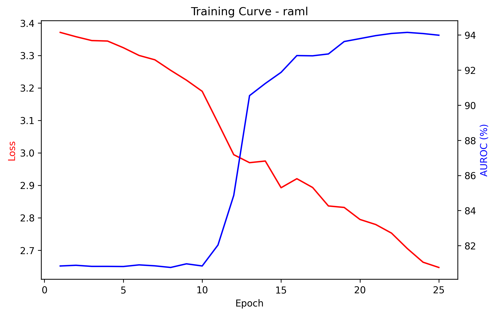
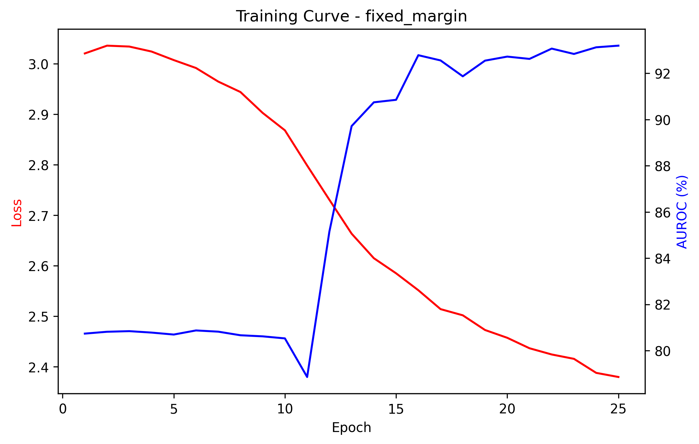
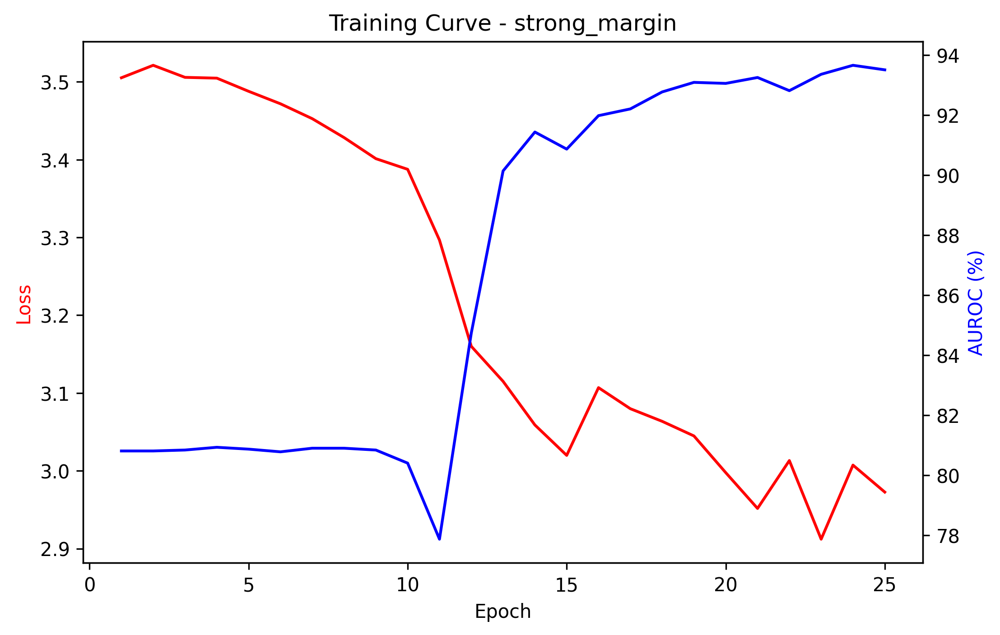

# Resolution-aware learning with margin-conditioned losses for CLIP-based industrial anomaly detection

## Abstract

Vision-language models such as CLIP have demonstrated strong zero-shot anomaly detection capabilities on industrial inspection benchmarks. However, directly applying frozen CLIP features to anomaly classification yields suboptimal performance because the pre-trained feature space is not aligned to the fine-grained normal/anomaly boundary required by manufacturing inspection. This work proposes a resolution-aware multi-scale learning framework (RAML) that fine-tunes a lightweight detection head on top of frozen CLIP features. The method introduces three key components: (1) a multi-scale cross-attention pyramid that fuses global, medium, and fine-grained CLIP patch features; (2) a text-visual fusion module that integrates category-specific prompt embeddings into the visual representation; and (3) a composite loss function combining center loss, input-size-conditioned margin loss, and supervised contrastive loss. On the MVTec AD benchmark, RAML achieves 94.15% image-level AUROC, improving over the zero-shot WinCLIP baseline by +13.29 percentage points, while maintaining a lightweight trainable parameter count.

## 1. Introduction

Industrial anomaly detection requires identifying defective products from images of manufactured goods. Traditional approaches rely on one-class classification [6] or reconstruction-based methods trained exclusively on normal samples. Recent advances in vision-language models, particularly CLIP [1], have enabled zero-shot anomaly detection through text-visual similarity scoring, as demonstrated by WinCLIP [11].

Despite their generality, zero-shot methods suffer from two limitations in the industrial setting. First, the frozen CLIP feature space does not capture the fine-grained distinctions between subtle manufacturing defects and normal surface variations. Second, single-scale feature extraction discards spatial information that is critical for detecting localized anomalies such as scratches, dents, or contamination.

Several recent works have attempted to address these limitations through prompt learning [12, 13, 14, 15, 16, 22, 25, 27, 29, 30] or adapter-based strategies [17, 18, 26, 28, 31]. However, most of these methods still operate on single-scale features and do not explicitly model the relationship between image resolution and anomaly discriminability.

This work addresses both limitations by proposing a multi-scale feature extraction and fusion pipeline that operates on frozen CLIP features, combined with a composite loss function designed to simultaneously tighten the normal feature cluster and push anomaly features beyond an adaptive margin boundary.

## 2. Related work

**Vision-language models for anomaly detection.** CLIP [1] provides a general-purpose visual encoder whose features transfer well to downstream tasks without fine-tuning. WinCLIP [11] first demonstrated competitive zero-shot anomaly detection by computing text-visual similarities with handcrafted prompts. Subsequent works introduced learnable prompts to improve alignment: AnomalyCLIP [12] proposed object-agnostic prompt learning, PromptAD [13, 14] explored few-shot and zero-shot prompt strategies, and AdaCLIP [15] combined learnable visual and text prompts. VCP-CLIP [16] introduced visual context prompting for anomaly segmentation, while InCTRL [17] used in-context residual learning with few-shot sample prompts. More recent methods include AA-CLIP [18] which incorporates anomaly-aware learning, Bayesian prompt flow learning [19] for probabilistic prompt modeling, and DLVP-CLIP [25] which uses dynamic local visual prompts. MoECLIP [26] employs mixture-of-experts for patch specialization, and several concurrent works [27, 28, 29, 30, 31] further explore multi-modal prompt fusion and frequency-domain features.

**Anomaly detection benchmarks.** MVTec AD [2] remains the standard benchmark for industrial anomaly detection, providing 15 categories with pixel-level annotations. VisA [3] extends this to more complex industrial scenarios. The recently introduced MVTec AD 2 [4] adds advanced scenarios including logical anomalies.

**Synthetic anomaly generation.** CutPaste [5] introduced self-supervised anomaly generation by cutting and pasting image patches, enabling training without real defective samples. PatchCore [7] demonstrated the effectiveness of memory bank approaches using patch-level features. Our method builds on the CutPaste paradigm to generate synthetic training anomalies.

**Metric learning for anomaly detection.** Center loss [9] learns compact feature representations by minimizing intra-class variation. Adaptive margin losses [10] improve few-shot classification by conditioning the margin on feature statistics. Supervised contrastive learning [8] extends contrastive objectives to leverage label information. Deep SAD [6] combines deep learning with semi-supervised anomaly detection objectives. Our composite loss function draws on all three paradigms.

**Multi-scale and resolution-aware approaches.** AnomalyDINO [20] demonstrated the value of multi-scale patch features using DINOv2 for few-shot detection. Self-supervised CLIP-guided methods [27] combine pseudo anomalies with multi-scale CLIP features. HLGFA [32] explores high-low resolution feature alignment. Our approach differs by introducing an explicit resolution-conditioned margin that adapts to information loss from image rescaling.

## 3. Method

### 3.1 Multi-scale feature extraction

Given an input image, features are extracted at three spatial scales using a frozen CLIP ViT-B/16 encoder [1]:

- **Scale 1 (1x1):** The full image is encoded to produce a single global feature vector (B, 512).
- **Scale 2 (2x2):** The image is divided into 4 non-overlapping patches, each encoded independently, producing (B, 4, 512).
- **Scale 3 (4x4):** The image is divided into 16 non-overlapping patches, each encoded independently, producing (B, 16, 512).

All CLIP parameters remain frozen throughout training. Only the downstream detection modules are optimized.

### 3.2 Cross-scale attention pyramid

The three scale features are fused through a bidirectional cross-attention pyramid:

1. The global feature (scale 1) attends to scale 2 patches via cross-attention.
2. The scale 2 aggregate attends to scale 3 patches.
3. The scale 3 aggregate attends back to the global and scale 2 context.

The three attended outputs are concatenated and projected through a two-layer MLP to produce a single fused representation of dimension 256.

### 3.3 Text-visual fusion

Category-specific text prompts (e.g., "a photo of a normal bottle" / "a photo of a damaged bottle") are encoded by the frozen CLIP text encoder and projected into the visual feature space. The fused visual feature attends to the normal and anomaly text embeddings via cross-attention with a learnable residual scale, allowing the model to incorporate semantic context from the text modality.

### 3.4 Composite loss function

The total training objective combines three losses:

**L_total = alpha * L_center + beta * L_margin + gamma * L_contrastive**

- **Center loss** [9] **(L_center):** Minimizes the distance between normal-sample features and a learnable center, encouraging a compact normal cluster.
- **Input-size-conditioned margin loss** [10] **(L_margin):** A hinge loss that pushes anomaly features beyond an adaptive margin from the normal center. The margin is defined as m = m_base + lambda_sigma * sigma + lambda_r * (1 - r/r_max), where sigma is the running standard deviation of normal features and r is the retained resolution ratio.
- **Supervised contrastive loss** [8] **(L_contrastive):** Attracts features of the same class and repels features of different classes in the embedding space.

Training anomalies are generated synthetically using CutPaste-style augmentation [5].

### 3.5 Inference scoring

The final anomaly score blends two signals:

- **Visual score:** Sigmoid output of the classification head applied to the refined feature.
- **Text score:** Softmax-normalized cosine similarity between patch features and the anomaly text prompt, combining global and local (top-k patch) similarities.

The blended score is computed as: score = (w_v * visual_score + w_t * text_score) / (w_v + w_t), with default weights w_v = 0.85, w_t = 0.15.

## 4. Experiments

### 4.1 Setup

All experiments are conducted on the MVTec Anomaly Detection dataset [2], which contains 15 categories of industrial products and textures with various defect types. The dataset is split with seed=42 for reproducibility. Models are trained for 25 epochs using AdamW (lr=5e-5, weight decay=0.02) with mixed-precision training on a single GPU.

### 4.2 Evaluation metrics

Models are evaluated using five image-level metrics: area under the receiver operating characteristic curve (AUROC), average precision (AP), maximum F1-score (F1-max), precision at the optimal F1 threshold, and recall at the optimal F1 threshold. All metrics are macro-averaged across the 15 categories.

### 4.3 Main results

| Method | AUROC | AP | F1-max | Precision | Recall |
|--------|------:|---:|-------:|----------:|-------:|
| WinCLIP [11] (zero-shot baseline) | 80.86 | 91.67 | 89.89 | 86.55 | 94.83 |
| RAML (fixed margin ablation) | 93.20 | 96.69 | 93.13 | 94.13 | 93.68 |
| RAML (strong margin ablation) | 93.66 | 96.61 | 94.06 | 93.04 | 95.95 |
| **RAML (full model)** | **94.15** | **96.98** | **94.39** | **95.10** | **94.31** |

### 4.4 Per-category results (full RAML model)

| Category | AUROC | AP | F1-max | Precision | Recall |
|----------|------:|---:|-------:|----------:|-------:|
| bottle | 92.31 | 98.19 | 96.00 | 100.00 | 92.31 |
| cable | 89.47 | 93.66 | 90.48 | 82.61 | 100.00 |
| capsule | 92.73 | 98.38 | 95.65 | 91.67 | 100.00 |
| carpet | 100.00 | 100.00 | 100.00 | 100.00 | 100.00 |
| grid | 96.67 | 98.81 | 95.65 | 100.00 | 91.67 |
| hazelnut | 95.54 | 97.45 | 93.33 | 87.50 | 100.00 |
| leather | 100.00 | 100.00 | 100.00 | 100.00 | 100.00 |
| metal_nut | 100.00 | 100.00 | 100.00 | 100.00 | 100.00 |
| pill | 91.95 | 98.40 | 94.74 | 96.43 | 93.10 |
| screw | 93.52 | 97.51 | 94.12 | 88.89 | 100.00 |
| tile | 100.00 | 100.00 | 100.00 | 100.00 | 100.00 |
| toothbrush | 88.89 | 95.83 | 90.91 | 100.00 | 83.33 |
| transistor | 77.08 | 78.24 | 71.43 | 83.33 | 62.50 |
| wood | 95.83 | 98.81 | 95.65 | 100.00 | 91.67 |
| zipper | 98.21 | 99.48 | 97.96 | 96.00 | 100.00 |

## 5. Ablation study

Two ablation variants isolate the contribution of the margin conditioning mechanism:

- **Fixed margin:** Uses a constant margin m = m_base without the sigma-adaptive or resolution-aware terms. This variant achieves 93.20% AUROC.
- **Strong margin:** Uses a stronger margin conditioning that scales more aggressively with feature dispersion. This variant achieves 93.66% AUROC.

The full model, which balances the margin terms with the center and contrastive losses, achieves the highest AUROC of 94.15%, demonstrating that the three loss components are complementary rather than redundant.

### Training curves

The training curves below show loss (red) and validation AUROC (blue) across 25 epochs for each variant.

<p align="center">
  
  
  
</p>

## 6. Repository structure

```
raml/
  models/
    raml_model.py          # main detector (MultiScaleCLIPDetector)
    multi_scale.py         # frozen CLIP multi-scale feature extractor
    cross_attention.py     # cross-scale attention pyramid
    fusion.py              # text-visual fusion module
    prompts.py             # category-specific prompt generation
  losses/
    combined_loss.py       # composite loss (center + margin + contrastive)
    center_loss.py         # center loss
    margin_loss.py         # input-size-conditioned margin loss
    contrastive_loss.py    # supervised contrastive loss
  data/
    mvtec_dataset.py       # MVTec AD data loader
  utils/
    metrics.py             # evaluation metrics
notebooks/
  run_winclip.ipynb        # zero-shot baseline evaluation
  run_raml.ipynb           # full RAML training and evaluation
  run_ablation_fixed.ipynb # fixed margin ablation
  run_ablation_strong.ipynb # strong margin ablation
configs/
  default.yaml             # default hyperparameters
results/
  metrics/                 # CSV result files per method
  plots/                   # training curve plots
```

## 7. Reproduction

### Requirements

```
torch>=2.0
torchvision
clip (openai)
scikit-learn
pandas
matplotlib
```

### Training

Open the corresponding notebook in Google Colab or a local Jupyter environment:

```bash
# full model
jupyter notebook notebooks/run_raml.ipynb

# ablation variants
jupyter notebook notebooks/run_ablation_fixed.ipynb
jupyter notebook notebooks/run_ablation_strong.ipynb

# zero-shot baseline (no training required)
jupyter notebook notebooks/run_winclip.ipynb
```

All outputs (model checkpoints, CSV metrics, training curve plots) are saved to the configured `SAVE_DIR`.

## 8. Conclusion

This work demonstrates that a lightweight, resolution-aware detection head trained on top of frozen CLIP features can substantially outperform zero-shot methods on the MVTec AD benchmark. The proposed multi-scale cross-attention pyramid captures both global context and local detail, while the composite loss function with input-size-conditioned margins produces well-separated feature clusters. The full RAML model achieves 94.15% image-level AUROC, representing a +13.29 point improvement over the WinCLIP zero-shot baseline with minimal computational overhead.

## References

[1] A. Radford, J. W. Kim, C. Hallacy, A. Ramesh, G. Goh, S. Agarwal, G. Sastry, A. Askell, P. Mishkin, J. Clark, G. Krueger, and I. Sutskever. Learning transferable visual models from natural language supervision. In *ICML*, 2021.

[2] P. Bergmann, M. Fauser, D. Sattlegger, and C. Steger. MVTec AD -- A comprehensive real-world dataset for unsupervised anomaly detection. In *CVPR*, 2019.

[3] Y. Zou, J. Jeong, L. Pemula, D. Zhang, and O. Dabeer. SPot-the-Difference self-supervised pre-training for anomaly detection and segmentation. In *ECCV*, 2022.

[4] T. Heckler-Kram et al. The MVTec AD 2 dataset: Advanced scenarios for unsupervised anomaly detection. *IJCV*, 2026.

[5] C.-L. Li, K. Sohn, J. Yoon, and T. Pfister. CutPaste: Self-supervised learning for anomaly detection and localization. In *CVPR*, 2021.

[6] L. Ruff, R. A. Vandermeulen, N. Görnitz, A. Binder, E. Müller, K.-R. Müller, and M. Kloft. Deep semi-supervised anomaly detection. In *ICLR*, 2020.

[7] K. Roth, L. Pemula, J. Zepeda, B. Schölkopf, T. Brox, and P. Gehler. Towards total recall in industrial anomaly detection. In *CVPR*, 2022.

[8] P. Khosla, P. Teterwak, C. Wang, A. Sarna, Y. Tian, P. Isola, A. Maschinot, C. Liu, and D. Krishnan. Supervised contrastive learning. In *NeurIPS*, 2020.

[9] Y. Wen, K. Zhang, Z. Li, and Y. Qiao. A discriminative feature learning approach for deep face recognition. In *ECCV*, 2016.

[10] R. Li, T. Han, R. Qian, C. Li, and J. Yang. Boosting few-shot learning with adaptive margin loss. In *CVPR*, 2020.

[11] J. Jeong, Y. Zou, T. Kim, D. Zhang, A. Ravichandran, and O. Dabeer. WinCLIP: Zero-/few-shot anomaly classification and segmentation. In *CVPR*, 2023.

[12] Q. Zhou, G. Pang, Y. Tian, S. He, and J. Chen. AnomalyCLIP: Object-agnostic prompt learning for zero-shot anomaly detection. In *ICLR*, 2024.

[13] Y. Li et al. PromptAD: Learning prompts with only normal samples for few-shot anomaly detection. In *CVPR*, 2024.

[14] Y. Li et al. PromptAD: Zero-shot anomaly detection using text prompts. In *WACV*, 2024.

[15] Y. Cao et al. AdaCLIP: Adapting CLIP with hybrid learnable prompts for zero-shot anomaly detection. In *ECCV*, 2024.

[16] Z. Qu et al. VCP-CLIP: A visual context prompting model for zero-shot anomaly segmentation. In *ECCV*, 2024.

[17] J. Zhu and G. Pang. Toward generalist anomaly detection via in-context residual learning with few-shot sample prompts. In *CVPR*, 2024.

[18] X. Ma et al. AA-CLIP: Enhancing zero-shot anomaly detection via anomaly-aware CLIP. In *CVPR*, 2025.

[19] Z. Qu et al. Bayesian prompt flow learning for zero-shot anomaly detection. In *CVPR*, 2025.

[20] T. Damm et al. AnomalyDINO: Boosting patch-based few-shot anomaly detection with DINOv2. In *WACV*, 2025.

[21] X. Ma et al. ReMP-AD: Retrieval-enhanced multi-modal prompt fusion for few-shot industrial visual anomaly detection. In *ICCV*, 2025.

[22] S. He et al. RareCLIP: Rarity-aware online zero-shot industrial anomaly detection. In *ICCV*, 2025.

[23] Y. Gong et al. FE-CLIP: Frequency enhanced CLIP model for zero-shot anomaly detection and segmentation. In *ICCV*, 2025.

[24] J. Zhu et al. Fine-grained abnormality prompt learning for zero-shot anomaly detection. In *ICCV*, 2025.

[25] Y. Zhang and Y. Zhang. DLVP-CLIP: Enhancing fine-grained zero-shot anomaly detection via dynamic local visual prompting. In *CVPR*, 2026.

[26] J. Park et al. MoECLIP: Patch-specialized experts for zero-shot anomaly detection. In *CVPR*, 2026.

[27] X. Chen et al. Self-supervised CLIP-guided for few-shot industrial anomaly detection. *IEEE TIM*, 2026.

[28] J. Li et al. Anomaly-aware prompt learning and multi-scale feature adaptation for zero-shot anomaly detection. 2026.

[29] D. Ha et al. CLIP-MDC: CLIP encoder based multimodal defect classification with synthetic anomaly generation. *Journal of Intelligent Manufacturing*, 2026.

[30] X. Ma et al. PAPL: Particle-based adaptive prompt learning for zero-shot industrial anomaly detection. *Pattern Recognition*, 2026.

[31] Y. Yan et al. HCLIP-AD: Calibrating text-image foundation models with hierarchical semantic alignment for zero-shot anomaly detection. *Pattern Recognition*, 2026.

[32] J. Xu et al. MRAD: Zero-shot anomaly detection with memory-driven retrieval. In *ICLR*, 2026.

[33] S. Lee et al. Bidirectional multimodal prompt learning with scale-aware training for few-shot multi-class anomaly detection. In *CVPR*, 2026.
